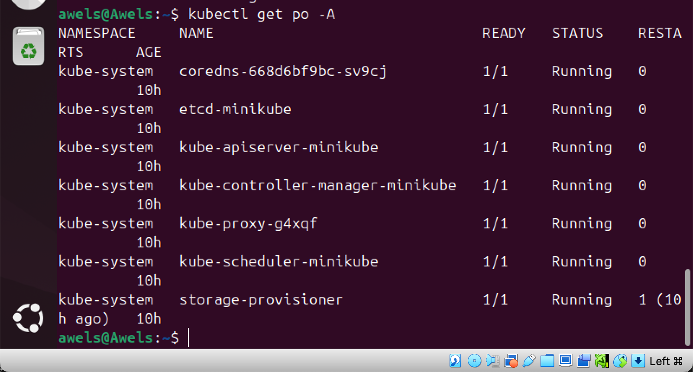
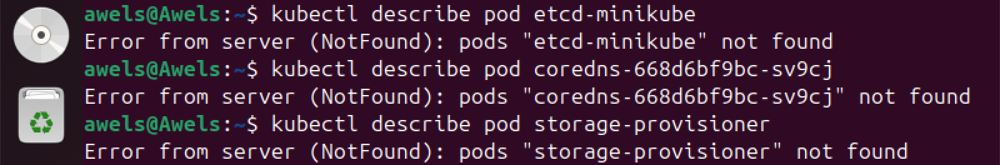
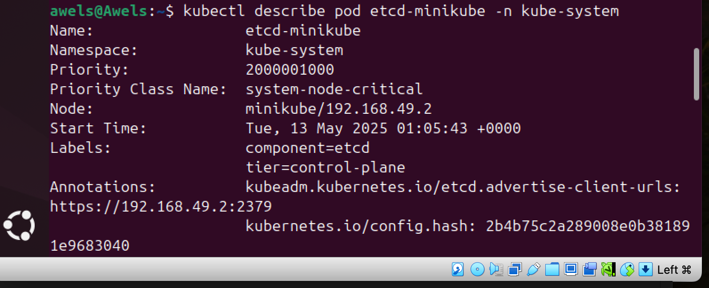
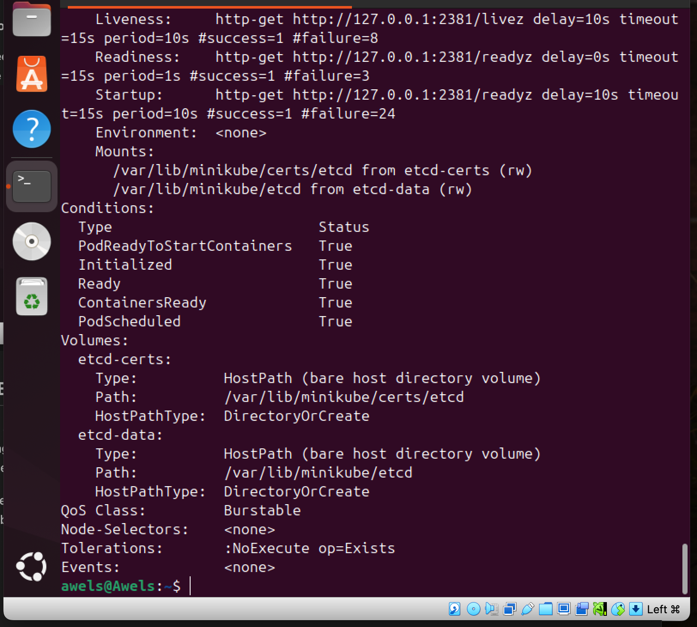
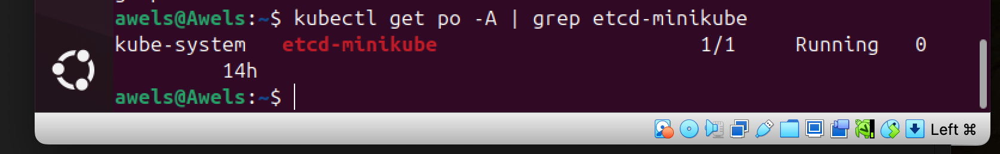
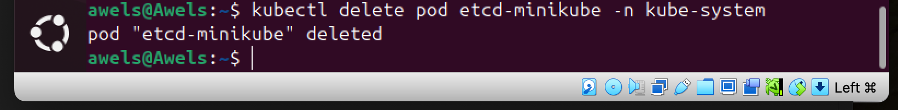

# KubernetePods
Here I will be submiting my Kubernete pod project

## PODS IN KUBERNETES
A pod in Kubernetes is like a small container for running parts of an application. 

## LIST PODS 
this is done by running the command "kubectl get po -A"
this command provides an overview of the current status of pods within the minikube cluster. the image below depicts this 

## INSPECT A POD 
this is done by running the command "kubectl describe pod <pod-name>" 
this command above can be used to gain detailed insights into a specific pod, including events, container information, and overall configuration. the image below depicts this. 

this however failed because i did not specify the correct namespace

By default, kubectl describe pod assumes the default namespace, unless you explicitly provide the namespace using -n flag.

But my pods (as seen in my output from kubectl get po -A) are actually in the kube-system namespace, not in the default one.

### How to correct your command
You need to specify the namespace like this "kubectl describe pod etcd-minikube -n kube-system". the result of this can be seen in the image below 

## DELETE A POD 
This is done by running this command "kubectl delete pod <pod name>
it is best to confirm the nam,espace of the pod before deleting the pod and this is done by using this command "kubectl delete po -A | grep etcd-minikube"
the result of this is in the image below. 

however because the pod is not in the default namespace, the right command to run is "kubectl delete pod etcd-minikube -n kube-system". the result of this is in the image below 

## How Containers Work Inside Pods:

Defining and running containers inside Kubernetes Pods

In Kubernetes, containers only exist inside Pods.
For a container to run, developers must first create a Pod definition, usually written in a YAML file.
This YAML file contains important details such as:
	•	What container images to use.
	•	What commands or processes the container should run.
	•	What settings or configurations it needs.

Once this Pod is created, it becomes the main unit of deployment in Kubernetes, meaning it’s the thing Kubernetes works with when managing your applications.

Using the command-line tool kubectl, developers can deploy these Pods into a Kubernetes cluster like Minikube.
This deployment process ensures that the containers inside the Pod run properly, and everything inside the Pod works together in a shared environment.

⸻

Summary (in even simpler terms):
	•	Containers = lightweight packages holding your apps.
	•	Pods = the thing that holds and runs containers inside Kubernetes.
	•	You cannot run containers directly in Kubernetes without wrapping them inside a Pod.
	•	Developers write YAML files to tell Kubernetes how to create Pods and what containers to include.
	•	Kubernetes uses these Pods as the smallest unit it manages, monitors, and deploys.
	•	kubectl is the tool used to deploy and manage Pods (and their containers) in your Minikube cluster.

## CONCLUSION 

This project has been an insightful introduction to Kubernetes Pods and Containers. By practically engaging with Minikube and running key commands, I was able to understand how Pods act as the essential building blocks within the Kubernetes ecosystem, encapsulating containers and managing them effectively.

A key takeaway was the discovery of namespaces, which highlighted the layered structure of Kubernetes clusters and the necessity of being namespace-aware when performing operations like inspecting or deleting pods. This realization deepened my grasp of Kubernetes best practices and helped me avoid the common mistake of assuming all pods run in the default namespace.

Moving forward, this project has not only enhanced my practical command-line skills but also given me a stronger architectural understanding of how Kubernetes organizes, isolates, and orchestrates workloads. It lays a strong foundation for more advanced Kubernetes operations, ensuring I can manage clusters more confidently and systematically.